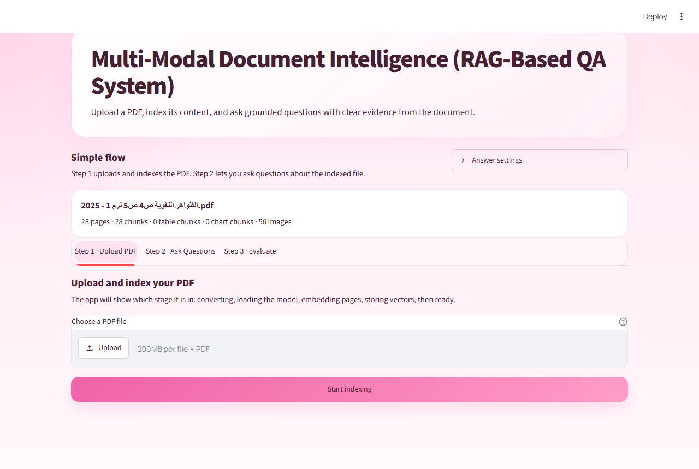
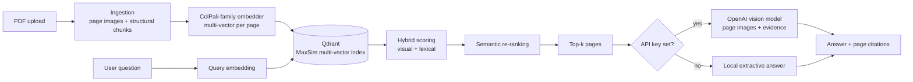

# Multi-Modal Document Intelligence

A visual retrieval-augmented generation (RAG) system for question answering over PDFs. Instead of relying only on extracted text, each page is embedded **as an image** with a ColPali-family vision-language retriever, so tables, charts, diagrams, and scanned pages remain searchable. Answers are generated from the retrieved page images and returned with page-level citations.



## Why visual retrieval

Text-only RAG pipelines lose information when a PDF contains tables, figures, complex layouts, or scanned content: the text extractor either drops it or flattens it into noise. ColPali-style retrievers embed the rendered page directly and match queries against it with late interaction (MaxSim over token-level vectors), so the layout and visual content become part of retrieval.

## Features

- **Page-level visual retrieval** with ColPali-family models (ColSmol, ColQwen2, ColPali), stored as multi-vectors in Qdrant with MaxSim scoring.
- **Hybrid ranking** that combines the visual MaxSim score with lexical matching over structural text chunks.
- **Semantic re-ranking** of the full candidate pool with a sentence-embedding model (MiniLM) before selecting the top-k pages. Can be disabled in `config.py`.
- **Structure-aware ingestion** with PyMuPDF: detects headings, extracts tables, flags chart and figure regions from vector drawings, and tags every chunk by modality (text, table, chart, image).
- **Token pooling** (hierarchical) to compress page embeddings and reduce storage and search cost.
- **Multimodal answer generation**: retrieved page images and extracted evidence are sent to an OpenAI vision model (default `gpt-4o-mini`), with citations kept separate from the answer body.
- **Offline fallback**: without an API key, the app returns an extractive, evidence-grounded answer built from the retrieved chunks.
- **Built-in evaluation**: a benchmark tab that reports latency, citation coverage, modality hit rate, and top retrieval score per query, with JSON export.

## Architecture



## Tech Stack

| Layer | Tools |
|---|---|
| Retrieval model | `colpali-engine` (ColSmol-256M by default; ColQwen2 and ColPali supported) |
| Vector store | Qdrant (multi-vector, MaxSim) |
| Re-ranking | `sentence-transformers/all-MiniLM-L6-v2` via Transformers |
| PDF processing | PyMuPDF, pdf2image |
| Generation | OpenAI API (vision) |
| Interface | Streamlit |
| Core | Python, PyTorch |

## Getting Started

### Requirements

- Python 3.10+
- Poppler (optional, used by `pdf2image`; PyMuPDF is used as a fallback)
- An OpenAI API key (optional, for LLM-generated answers)

### Install and run

```bash
python -m venv .venv

# macOS / Linux
source .venv/bin/activate
# Windows
.venv\Scripts\activate

pip install -r requirements.txt
streamlit run app.py
```

Then open `http://localhost:8501`.

### Configuration

Create a `.env` file in the project root (it is git-ignored):

```env
OPENAI_API_KEY=your-key-here
OPENAI_MODEL=gpt-4o-mini
COLPALI_MODEL_NAME=vidore/colSmol-256M
COLPALI_DEVICE=cpu
COLPALI_POOL_FACTOR=2
```

The API key can also be entered for the current session under **Answer settings** in the app. If no key is provided, the app uses the local extractive fallback.

## Usage

1. **Upload PDF**: the app converts pages, loads the model, embeds pages, and stores vectors, with live progress for each stage.
2. **Ask Questions**: choose an indexed document, ask a question, and review the answer, its cited pages, the extracted evidence, and the retrieved page images.
3. **Evaluate**: run the benchmark queries against an indexed document and export the results as JSON.

## Project Structure

```
app.py                 Streamlit interface (upload, Q&A, evaluation tabs)
pipeline.py            End-to-end orchestration: ingest, retrieve, generate
ingestion.py           PDF rendering and structure extraction (headings, tables, charts)
embedder.py            ColPali-family model loading, page/query embedding, token pooling
vector_store.py        Qdrant indexing, hybrid scoring, re-ranking
semantic_reranker.py   Sentence-embedding re-ranker
generator.py           OpenAI multimodal generator and local fallback
evaluation.py          Benchmark queries and retrieval/grounding metrics
config.py              Environment-based settings
```

## Limitations

- The default Qdrant client runs **in memory**, so indexed documents are cleared when the app restarts.
- Indexing on CPU is slow for long documents; a GPU is recommended for larger PDFs and bigger retrieval models.
- Table and chart detection relies on heuristics (PyMuPDF table finder, vector-drawing counts, caption keywords) rather than a trained layout model.
- The benchmark queries are generic and English-only; they measure retrieval and grounding behavior, not answer correctness against ground truth.
